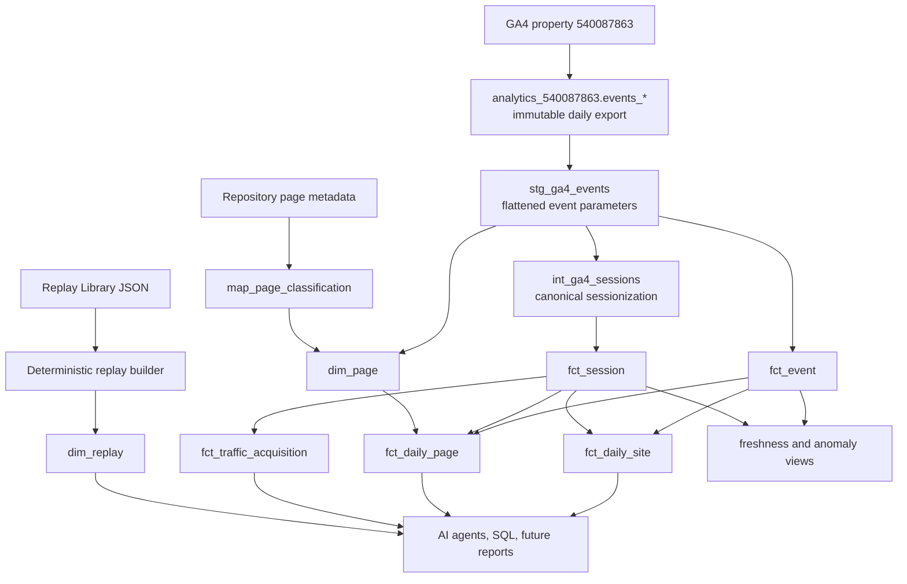

# Analytics architecture

## Design goals

The semantic layer gives humans and AI agents stable tables that do not require knowledge of GA4's nested export schema. It remains intentionally small: BigQuery SQL, one daily scheduled workflow, and repository-owned metadata.

## Dataset boundaries

### `analytics_540087863`

Google-managed, immutable source of record. No project SQL writes to this dataset. Daily tables can be updated by GA4 for up to three days as late events arrive.

### `terminus_analytics_dev`

Development and reconciliation environment. Models are deployed and validated here first. Rebuilding development objects is reversible.

### `terminus_analytics`

Production semantic layer. It is created or modified only after the analytics-layer promotion checkpoint has been approved.

## Modeling decisions

### Dates and timestamps

- `event_timestamp` is UTC.
- `event_date` is the GA4 property reporting date in `America/Los_Angeles`.
- Sessions are assigned to the reporting date on which their first event occurred.
- Scheduled refreshes rebuild seven reporting dates. GA4 documents that daily tables can receive late events for up to three days; seven days adds a conservative buffer.

### User identity

`user_pseudo_id` is the canonical modeled user identifier. It represents a browser/device pseudonym, not a known person. Counts can differ from the GA4 interface because the interface may use another reporting identity, thresholding, or modeled data.

### Sessions

A session is the composite of non-null `user_pseudo_id` and the `ga_session_id` event parameter. Timestamp proximity is never used as a substitute when `ga_session_id` exists. Events missing either component remain in the event fact but cannot contribute to session metrics.

### Session acquisition

Routine acquisition reporting uses session-level last-click attribution. The extraction preference is:

1. `session_traffic_source_last_click.cross_channel_campaign`
2. `session_traffic_source_last_click.manual_campaign`
3. event-collected manual campaign fields
4. `(direct)` / `(none)` defaults

First-user fields are retained separately and are not substituted for session acquisition.

### Page classification

Canonical paths are normalized by removing query strings, fragments, duplicate trailing slashes, and a trailing slash other than `/`. Stable classifications come from `map_page_classification`, which is maintained as SQL in the repository. Newly observed paths remain visible as `unclassified` so classification gaps are monitorable.

### Environment boundary

Staging retains every exported event and marks whether its normalized hostname is in the production allowlist: `terminusmaximus.com` or `www.terminusmaximus.com`. Public event, session, page, and aggregate models include only allowlisted production traffic. Monitoring continues to expose excluded hostname counts so local or unexpected traffic is auditable without contaminating production metrics.

### Replay metadata

`dim_replay` is generated from `src/data/replay-library/PgC5E7jYNBPh8SoE9CGtXMH.json`. Only analytically useful, public replay fields are emitted. Internal notes and discovery workflow fields are excluded.

## Refresh strategy

One scheduled multi-statement GoogleSQL workflow runs daily off the hour after the GA4 daily export normally arrives. It deletes and rebuilds the latest seven reporting dates in dependency order:

1. staging events
2. sessions
3. dimensions
4. facts
5. monitoring materializations, if any

The production schedule should run at `20:07 UTC` (12:07 PST / 13:07 PDT). UTC scheduling does not adjust for daylight saving time; the chosen time is deliberately safe in both seasons. Failure email notifications should be enabled.

## Cost controls

- Every raw wildcard query must constrain `_TABLE_SUFFIX`.
- Modeled facts are partitioned by reporting date and require partition filters where practical.
- Frequently filtered columns are clustered only when useful (`event_name`, `page_path`, acquisition fields).
- The seven-day lookback bounds routine scans.
- No streaming pipeline, external orchestrator, or paid transformation framework is used.
- Manual queries should set a maximum-bytes-billed limit in the console when exploring raw data.

At current traffic volume, storage and scheduled-query cost should remain negligible and normally within BigQuery's free usage allowances. Budget alerts are notifications, not a spending cap.

## Deferred objects

- `dim_content`: deferred until a content item demonstrably spans multiple pages or needs metadata distinct from `dim_page`.
- `dim_source` and `dim_campaign`: deferred until maintained campaign metadata exists.
- `fct_replay_engagement` and `fct_replay_performance`: deferred until the new instrumentation is deployed and validated.
- Dashboards, emails, advanced attribution, and Search Console remain outside Phase 3.
